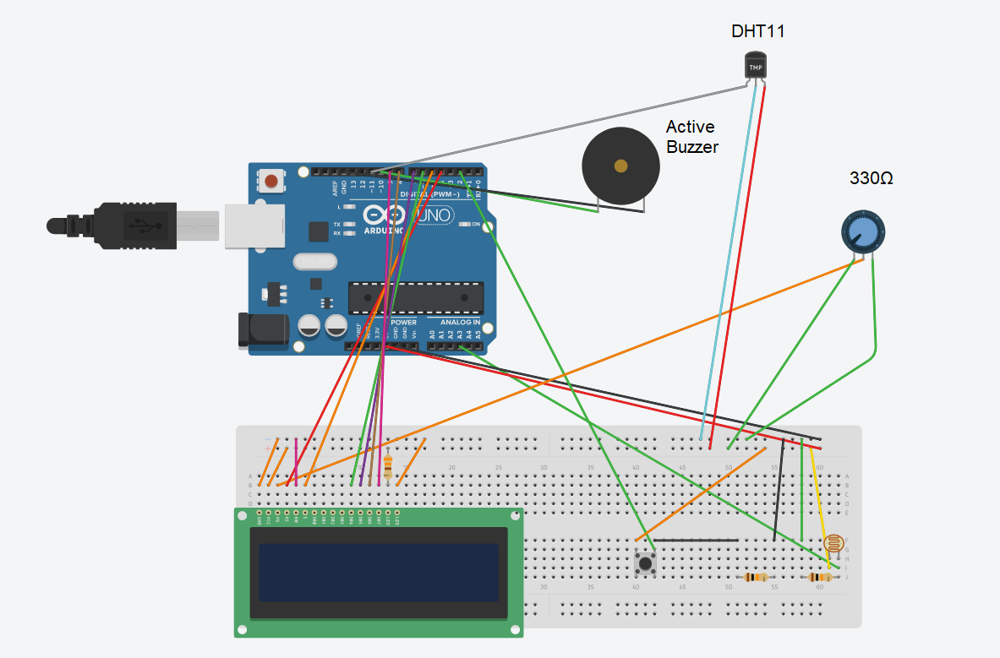

# GUI_FileTransfer

GUI Project for File Transfer Application on Python

Libraries used:
* AppJar
* Paramiko 
* GuiZERO

# For testing use a VM (with Ubuntu, Mint, etc.), but with a "Bridged Adapter". On your VM go to your OS (in my case Ubuntu):
1. Go to **Settings** -> **Network**
2. Choose *Adapter 1*
3. Check *"Enable Network Adapter"*
4. Select **Bridged Adapter** for *Attacked to*
This will make the VM use the same network as the host. 
> If you use bridged networking, the virtual machine is a full participant in the network. It has access to other machines on 
> the network and can be contacted by other machines on the network as if it were a physical computer on the network.

# Arduino sensor - connection schematic

USB connection needs to be hooked up to the interpreter's PC, in order to allow serial transfer.

Buzzer is optional, but is useful for error signaling. 

Contrast may also be hooked up directly to a resistor, but not recommended - if too low load is connected, it may burn the LCD. Reference your LCD manual for more details.
